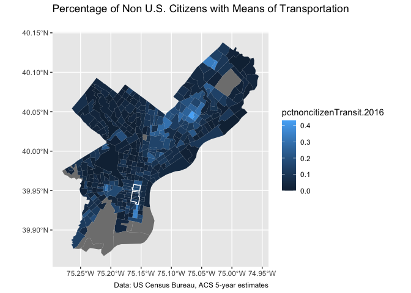

Lab 2 Assignment
================
Myron Bañez
9/13/2021

``` r
library(tidyverse)
library(tidycensus)
library(sf)
library(tmap) # mapping, install if you don't have it
set.seed(717)
```

## Load data from {tidycensus}

``` r
Lab_acs_vars <- c("B08111_001E", # Total Means of Transportation
                  "B08111_005E", # Means of Transportation for Non U.S. Citizens
                  "B05001_001E", # Total Citizens
                  "B05001_006E") # Total Non U.S. Citizens 

Lab_myTracts <- c("42101000200", "42101000500", "42101000901", "42101000902", "42101001101","42101001102", "42101001500", "42101001800","42101002400")

Lab_acsTractsPHL.2016.sf <- get_acs(geography = "tract",year = 2016, variables = Lab_acs_vars, geometry = TRUE, state = "PA",county = "Philadelphia", output = "wide") %>% 
  rename (total_transit.2016 = B08111_001E,
          total_noncitizenTransit.2016 = B08111_005E,
          total_citizen.2016 = B05001_001E,
          total_noncitizen.2016 = B05001_006E) %>%
  mutate(citizenPct.2016 = total_noncitizen.2016/total_citizen.2016,
         pctnoncitizenTransit.2016 = total_noncitizenTransit.2016/total_transit.2016) %>%
mutate(AsianNeighborhood = ifelse(GEOID %in% Lab_myTracts, "SOUTH PHILLY", "REST OF PHILADELPHIA"))
```

## Transform to WGS84 with {sf}

``` r
Lab_acsTractsPHL.2016.sf_WGS84 <- Lab_acsTractsPHL.2016.sf %>% 
  st_transform(crs = "EPSG:4326")

st_crs(Lab_acsTractsPHL.2016.sf_WGS84)
```

    ## Coordinate Reference System:
    ##   User input: EPSG:4326 
    ##   wkt:
    ## GEOGCRS["WGS 84",
    ##     DATUM["World Geodetic System 1984",
    ##         ELLIPSOID["WGS 84",6378137,298.257223563,
    ##             LENGTHUNIT["metre",1]]],
    ##     PRIMEM["Greenwich",0,
    ##         ANGLEUNIT["degree",0.0174532925199433]],
    ##     CS[ellipsoidal,2],
    ##         AXIS["geodetic latitude (Lat)",north,
    ##             ORDER[1],
    ##             ANGLEUNIT["degree",0.0174532925199433]],
    ##         AXIS["geodetic longitude (Lon)",east,
    ##             ORDER[2],
    ##             ANGLEUNIT["degree",0.0174532925199433]],
    ##     USAGE[
    ##         SCOPE["Horizontal component of 3D system."],
    ##         AREA["World."],
    ##         BBOX[-90,-180,90,180]],
    ##     ID["EPSG",4326]]

## Plot with {ggplot2}

<!-- -->
